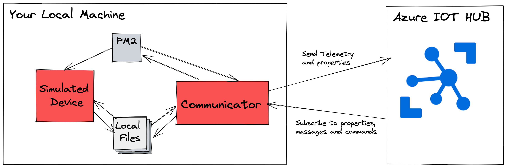

# POC Azure IOT HUB - Device Communications

**Azure IOT Hub - A Comprehensive Proof of Concept Walkthrough in Node.js!**

### :crystal_ball: About

This project is a proof of concept that will demonstrate the potential of Azure IOT Hub for onboarding IOT devices to the cloud with minimal disruption to existing business logic by separating communication to the cloud and the device's current business logic. It offers a simple and extensible out-of-the-box architecture with some basic features using the Azure IOT Official SDK for Node.js.

In order to understand the POC, you will need some basic knowledge about the Azure IOT Hub universe (Digital Twins, telemetry, Node.js SDK...) and the PM2 library, as it is used to control the lifecycle of the device.


### :tada: Features 

- A simple IoT device with sensor data simulated and its life cycle controlled by PM2 or independently.
- An independent communicator process that handles communication with Azure IoT.
- Subscribe to changes in Digital Twin Properties
- Notification of property changes to the Azure Digital Twin Device
- Telemetry data is sent in intervals to the Azure IoT Hub.
- Manage the execution of commands from the cloud to the device, such as stopping, starting, and resetting, with a real impact on the simulated IoT device.
- Upload the log files to the cloud using a single command.
- An easy way to extend the communication between the communicator and the simulated device is to implement your favorite protocols, such as HTTP, WebSockets, and Signals.


### :shipit: Architecture




There are two isolated processes running on your machine: the simulated device and the Communicator. Both processes are managed by PM2 and can read and write the files in the folder `device-to-cloud/iot-device/data/*.json`. The communication between both processes is done by reading and writing the files, but this can be easily refactored to webhooks, signals, etc.

The simulated device is generating random data and storing it in the `device-to-cloud/iot-device/data/values.json` at intervals. It is also reading the values in `device-to-cloud/iot-device/data/settings.json` to determine if the temperature is within the expected threshold. If the temperature is not within the expected range, it will add an additional alert message in the `device-to-cloud/iot-device/data/values.json`.

The communicator will authenticate against the Azure IOT Hub, register handles for property changes, commands, etc., send telemetry data from the `device-to-cloud/iot-device/data/values.json` to the Azure IOT Hub in intervals, use child processes to trigger changes in PM2 for the simulated device, and react to any change in the digital twin by overwriting the `device-to-cloud/iot-device/data/settings.json` file with the new values.

 
### :rocket: Installation

#### Azure setup

You need to [register a new device](https://github.com/Azure/azure-iot-device-ecosystem/blob/master/setup_iothub.md#set-up-and-manage-azure-iot-hub) and store the connection string in a .env file in the root folder of this project, as follows:

The secret shape looks like this: `HostName=********=`. Please use the entire string without making any modifications.

```
IOTHUB_DEVICE_CONNECTION_STRING={YOUR SECRET}
```

#### Local development

Download the source code
```bash
git clone https://github.com/UlisesGascon/POC-azure-iot-hub-device-communications
cd POC-azure-iot-hub-device-communications
```

Install pm2 in your machine
```bash
npm i -g pm2@5.2.2
```

Install the project dependencies 
```bash
nvm use
npm i
```
Start the project:

```bash
npm run machine:start
```

Stop the project:

```bash
npm run machine:stop
```

Clean the project:

```bash
npm run machine:clean
```

Uninstall global dependencies:
```bash
npm uninstall -g pm2@5.2.2
```

### :satellite: Usage

The simplest way to interact with the project from the cloud is to use [Azure IoT Explorer ](https://github.com/Azure/azure-iot-explorer#getting-azure-iot-explorer) and [configure it properly](https://github.com/Azure/azure-iot-explorer#configure-an-iot-hub-connection).


**Properties**

The model is simple and only uses the `minTemp` and `maxTemp`. These values can change from the twin and are propagated to the simulated devices, overwriting [device configuration file](device-to-cloud/iot-device/data/settings.json).

**Telemetry**

The device will send `windSpeed`, `temperature` and `humidity` values to the cloud.

This is a sample:

```json
{ 
    "windSpeed": 15, 
    "temperature": 23, 
    "humidity": 68 
}
```

**Commands**

- `stop`: It will stop the device but will not affect the communicator.
- `start`: It will start the device but will not affect the communicator.
- `restart`: It will restart the device but will not affect the communicator.
- `sync-logs`: It will send the contents of the log file to the cloud.

**Cloud to Device messages**

Send messages from the cloud to the device, and the communicator will print the content in the logs.


### :warning: Important

This is a proof-of-concept repository, so the idea is more to demonstrate what the Azure IOT SDK and the Azure IOT Hub are capable of, rather than building a reliable, reusable repository template for your next IOT Project. If you wish to reuse this project, please refactor the code and include some tests, and try to automate the infrastructure by using Infrastructure-as-Code solutions such as Terraform for the Azure IOT Hub part. Furthermore, if you would like to contribute your changes back, that would be fantastic.
